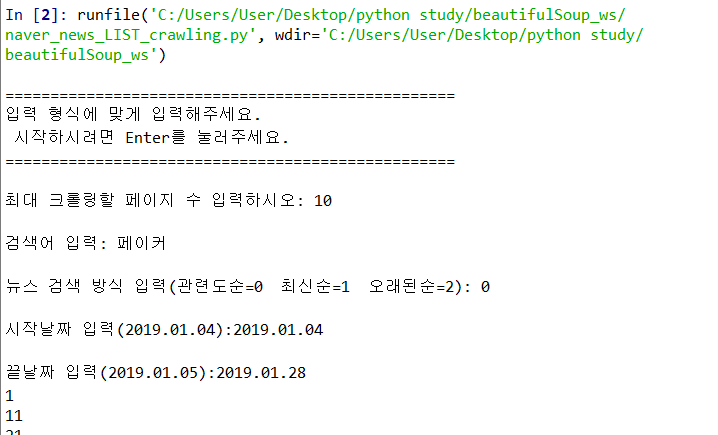
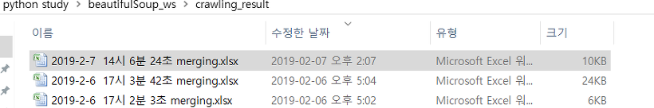
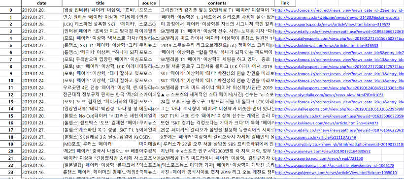

# naver_news_crawling
Python을 이용한 네이버 뉴스 리스트 크롤링 프로그램 (naver news crawling)

------
 사용 라이브러리  
-------------
- BeautifulSoup
- requests
- pandas
- datetime (현 시간을 이름으로 저장하기 위함)
- re  (정규표현식)

 프로그램 소개 
 -------------
- select 연산자 사용 (find x)
- 크롤링 해오는 것 : 링크,제목,신문사,날짜,내용요약본
- 날짜,내용요약본  -> 정제 작업 필요
- 크롤링 결과 : 리스트 -> 딕셔너리 -> df -> 엑셀로 저장 

------
 실행 
-------------

